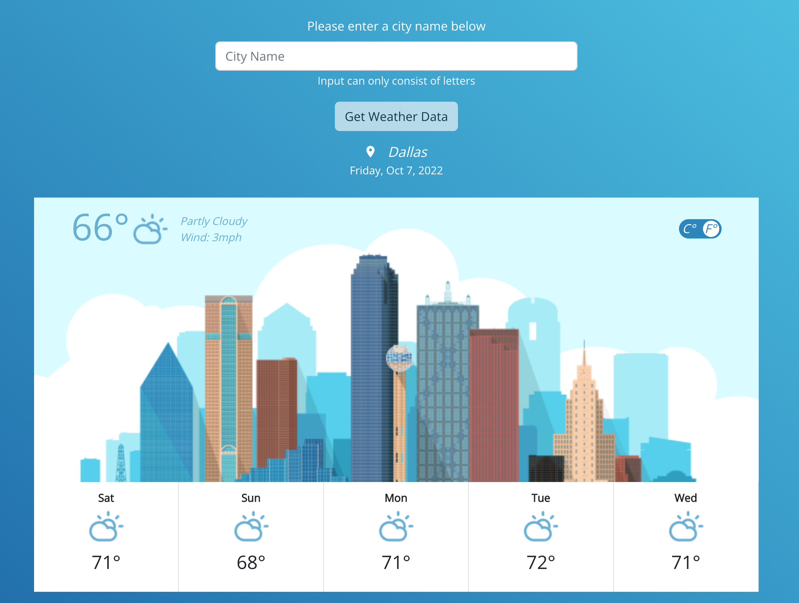

# Credera Craft Interview

This project consists of a simple React app deployed to Netlify. It displays the current weather data and 5-day forecast data for Dallas at initial load. Users can then input different cities to fetch that city's current weather and 5-day-forecast.

The live application can be seen [here](https://main--majestic-monstera-1c192b.netlify.app/).

The web application is fully responsive through the use of Bootstrap's grid system and CSS media queries. Testing was conducted with Jest and React Testing Library.

## Table of Contents

- [Getting Started](#getting-started-with-create-react-app)
- [Technologies Used](#technologies-used)
- [Requirements](#requirements)
- [Optional Requirements](#optional-requirements)
- [Next Steps](#next-steps)
- [Learn More](#learn-more)

## Getting Started with Create React App

This project was bootstrapped with [Create React App](https://github.com/facebook/create-react-app). In order to work with this web application locally, clone or fork this repository and then use the scripts detailed below.

### Available Scripts

In the project directory, you can run:

#### `npm start`

Runs the app in the development mode.\
Open [http://localhost:3000](http://localhost:3000) to view it in the browser.

The page will reload if you make edits.\
You will also see any lint errors in the console.

#### `npm test`

Launches the test runner in the interactive watch mode.\
See the section about [running tests](https://facebook.github.io/create-react-app/docs/running-tests) for more information.

#### `npm run build`

Builds the app for production to the `build` folder.\
It correctly bundles React in production mode and optimizes the build for the best performance.

The build is minified and the filenames include the hashes.\
Your app is ready to be deployed!

See the section about [deployment](https://facebook.github.io/create-react-app/docs/deployment) for more information.

## Technologies Used

- @testing-library/react: 13.4.0
- bootstrap: 5.2.2
- dompurify: 2.4.0
- react: 18.2.0
- react-bootstrap: 2.5.0
- typescript: 4.8.4
- validator: 13.7.0
- msw: 0.47.4

**Note:** These are only the major packages and programs used. For a full list of packages and versions check the `package.json` file.

## Requirements

### Application should be built using React

CRA was used.

### Must match the provided comp as closely as possible on Desktop

This app matches the provided comp nearly identically. A user input bar was added and the location does not display the state abbreviation. These are the two major differences.

### Must be responsive

A combination of Bootstrap's grid system and CSS media-queries provides proper responsiveness. The primary content of the web application will scale with screen size. In addition, at 768px the primary content undergoes adjustments that better fit small screens such as phones and small tablets.

Major changes for screen sizes under 768px:

1. Temp toggle button moves to top right corner
2. Skyline picture is removed as it was distracting on small screens
3. Weekly forecast transitions to a flex-column layout rather than a row

### Should use any open API to gather weather information

[OpenWeather's APIs](https://openweathermap.org/api) were used to request the weather data. Specifically their `Current Weather Data` API and `5 Day / 3 Hour Forecast` API were used.

This API was used as it was free, had sufficient documentation, and allowed city names to be used directly in requests. Many open APIs required latitude and longitude.

### Should allow toggling between Fahrenheit and Celsius

Using the temp toggle button, temperatures for both the current weather and the weekly forecast can be adjusted between Fahrenheit and Celsius.

### Icons should correspond to proper weather conditions

The icons were pulled directly from the Figma Sketch. Storms use the thunderstorms icon. Light rain uses the drizzle icon. Rain uses the rain icon. Cloudy and sunny uses the partly cloudy icon. As you change the city, you will see the weather icons change as well.

## Optional Requirements

Two of the optional requirements were implemented as well as two additions of my own.

### Allow user input for city

An input bar was added to allow users to select their specific city. Cities can consist of letters, periods, and dashes. If a city does not exist in the API the app will display error messages.

domPurify and validator were used to ensure safe and correct user input is passed to the rest of the application.

### Deploy web application

This web application is deployed to Netlify [here](https://main--majestic-monstera-1c192b.netlify.app/).

### Test web application

Testing was not mentioned in the instructions document. However, tests for all components and functionality were implemented using Jest and React Testing Library.

### Typescript

Typescript was not mentioned in the instructions document. However, typescript was used to increase readability of code and catch any potential errors at compile time.

## Next Steps

This web application meets all requirements requested. If I were to continue working on this web application here is a list of some features and improvements I would like to implement in order from most important to least important.

- Improve mobile UX. Instructions said to focus on desktop first as opposed to mobile-first design.
- Improve accessibility features (text contrast, temp toggle button)
- Improve user feedback on input bar (red outline for invalid input, error message if city does not exist, etc.)
- Add city dropdown to input bar to ensure only city names can be selected
- Style current weather error message
- Combine parseForecastData and parseWeatherData as they have very similar functionality
- Convert CSS to CSS modules (Eliminate risk of conflicting class names)
- Implement e2e testing with Cypress (Currently done with RTL but Cypress is a better tool for e2e)
- Cloud animations (Improve user experience)
- Implement ContextAPI to handle some of the prop drilling (fetchDataError and tempIsCelsius props) (Really not necessary at this point)
- Implement some SEO best practices (data schema, opengraph meta tags, keywords, etc)
- Review tests to check for duplicate coverage (Improves speed of running tests) (Not an issue right now)
- Convert icons to webp (Really not necessary at this point)

## Learn More

- [Create React App documentation](https://facebook.github.io/create-react-app/docs/getting-started)
- [React documentation](https://reactjs.org/)
- [React-Bootstrap documentation](https://react-bootstrap.github.io/getting-started/introduction/)
- [Bootstrap documentation](https://getbootstrap.com/docs/5.2/getting-started/introduction/)
- [OpenWeather API documentation](https://openweathermap.org/api)
- [Jest documentation](https://jestjs.io/docs/getting-started)
- [React Testing Library documentation](https://testing-library.com/docs/react-testing-library/intro/)
- [Mock Service Worker documentation](https://mswjs.io/)
